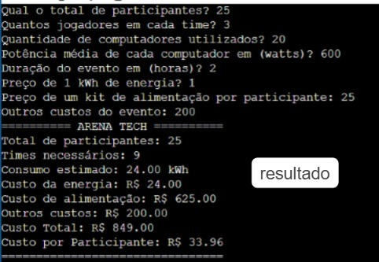
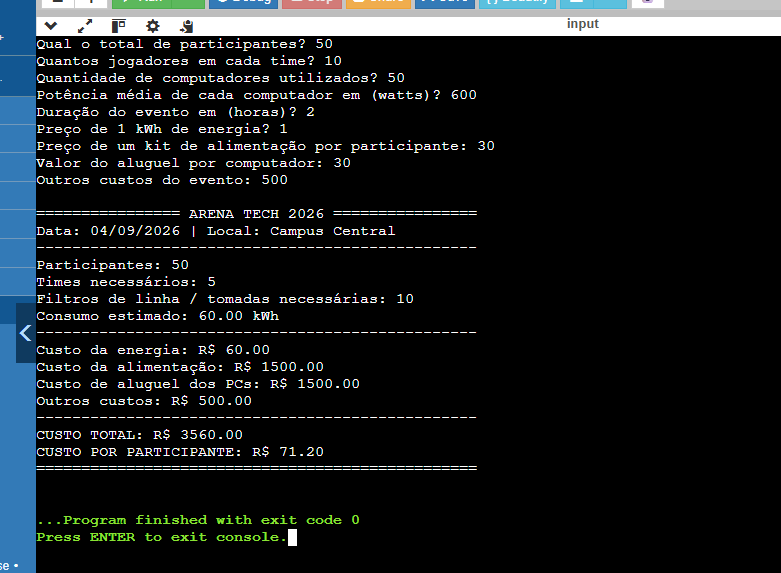
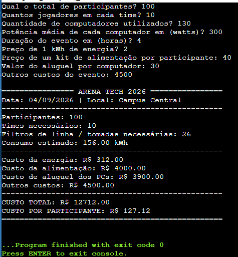
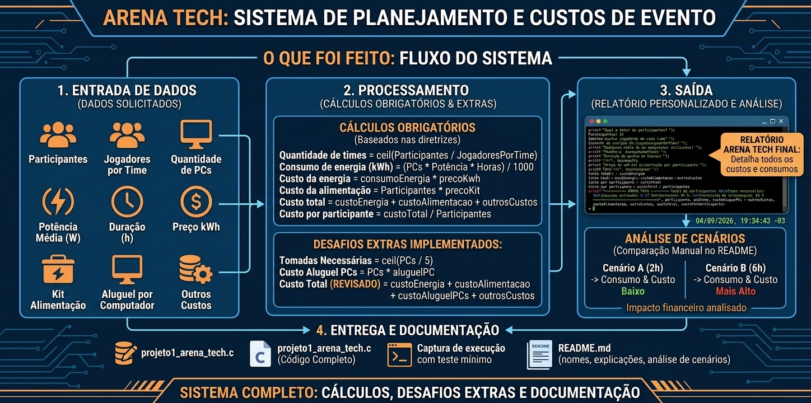

# Projeto Arena Tech - Algoritmos e Pensamento Computacional

## Integrantes
* [Eloysa R. Santos](https://github.com/elosantos24)
* nom - @
* nome - @
* nom - @
* nome - @

---

## Explicação da Solução
O programa coleta os dados de infraestrutura e custos de um evento e realiza os cálculos operacionais e financeiros. A função `ceil()` com casting `(float)` garante o arredondamento para cima do número de equipes e tomadas. O consumo de energia é convertido para kWh dividindo a potência por 1000. Por fim, o relatório formata todas as saídas financeiras com duas casas decimais (`%.2f`).

---

## Teste Mínimo Obrigatório
Entradas utilizadas no teste:
* **Participantes:** 25
* **Jogadores/Time:** 3
* **Computadores:** 20
* **Potência:** 600 W
* **Duração:** 2 h
* **Preço kWh:** R$ 1.00
* **Kit Alimentação:** R$ 25.00
* **Aluguel por PC:** R$ 0.00 *(para alinhar ao teste padrão)*
* **Outros Custos:** R$ 200.00

---

## Desafios Extras Implementados
1. **Infraestrutura elétrica:** Cálculo automático de filtros de linha/tomadas (1 para cada 5 computadores).
2. **Custo de Equipamentos:** Inclusão da variável de aluguel individual por PC no custo geral.
3. **Identidade Visual:** Relatório final personalizado com cabeçalho, data e linhas separadoras.
4. **Comparação de Cenários (Duração do Evento):**
   * **Cenário A (2 horas):** Consumo de 24.00 kWh | Custo de Energia: R$ 24,00 | Custo Total: R$ 849,00
   * **Cenário B (6 horas):** Consumo de 72.00 kWh | Custo de Energia: R$ 72,00 | Custo Total: R$ 897,00
   * **Conclusão:** Triplicar a duração do evento aumenta o custo total em apenas 5,6% (R$ 48,00), pois os custos fixos (alimentação e outros) correspondem à maior fatia do orçamento.

# OUTROS TESTES

## Desafios Extras - Comparação de Cenários (Duração do Evento)

Realizamos o teste comparativo alterando apenas a **duração do evento**, mantendo a base do teste obrigatório (25 participantes, 20 PCs de 600W, R$ 1,00/kWh, R$ 25,00 kit alimentação, R$ 200,00 outros custos e aluguel de R$ 50,00/PC):

* Cenário A (2 horas de evento):**
  -  Consumo: 24.00 kWh
  -  Custo Energia: R$ 24,00
  -  Custo Total: R$ 1.849,00
  -  Custo por Participante: R$ 73,96

* Cenário B (6 horas de evento - 3x mais tempo):**
  -  Consumo: 72.00 kWh
  - Custo Energia: R$ 72,00
  - Custo Total: R$ 1.897,00
  - Custo por Participante: R$ 75,88

# Conclusão da Análise:
Aumentar a duração do evento em 200% (de 2h para 6h) gera um impacto financeiro de apenas R$ 48,00 a mais no custo total (aumento de ~2,6%), pois os custos com alimentação, aluguel de PCs e infraestrutura fixa representam a maior parte do orçamento geral.

